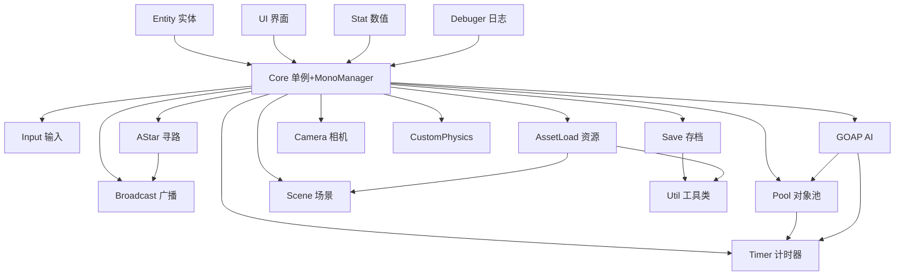

# MyFramework 框架总览

> Unity 游戏开发框架 —— 模块化、可扩展、开箱即用的 C# 框架，覆盖 AI、寻路、资源加载、对象池、事件广播、存档、日志、计时器、输入系统、UI、数值系统等 18 个核心模块。

---

## 模块总览

| # | 模块 | 文档 | 简介 |
|---|---|---|---|
| 1 | Core 核心与单例 | [[01-Core-核心与单例]] | MonoManager 生命周期管理 + 三种单例基类 |
| 2 | Broadcast 广播系统 | [[02-Broadcast-广播系统]] | 全局事件广播/监听，支持 0~4 个参数的泛型回调 |
| 3 | Timer 计时器 | [[03-Timer-计时器]] | 支持暂停/重置/移除的计时器，带间隔回调与 HitStop |
| 4 | Pool 对象池 | [[04-Pool-对象池]] | GameObject 自动释放池 + 预创建池 + 泛型数据池 |
| 5 | Debuger 日志系统 | [[05-Debuger-日志系统]] | 带颜色标签的条件编译日志 + 文件存储 + 线程安全写入 |
| 6 | Input 输入系统 | [[06-Input-输入系统]] | 新版 InputSystem + 旧版 InputManager，支持改键 |
| 7 | Save 存档系统 | [[07-Save-存档系统]] | JSON 存档（支持 AES 加密）、SaveContainer 泛型容器 |
| 8 | AssetLoad 资源加载 | [[08-AssetLoad-资源加载]] | Addressables / AssetBundle / Resources / Editor / UWQ 五大方案 |
| 9 | Scene 场景管理 | [[09-Scene-场景管理]] | Addressables 异步场景加载、切换、批量卸载 |
| 10 | Stat 数值系统 | [[10-Stat-数值系统]] | 叠加区/加乘区/累乘区 三层数值修正框架 |
| 11 | Entity 实体组件 | [[11-Entity-实体组件]] | 组件化实体架构、生命周期统一管理 |
| 12 | UI 界面基类 | [[12-UI-界面基类]] | BasePanel 自动绑定 UI 控件 + 事件分发 |
| 13 | Util 工具类 | [[13-Util-工具类]] | JsonManager、EncryptionUtil、PathUtil、RandomUtility 等 |
| 14 | AI GOAP 目标导向行动规划 | [[14-AI-GOAP-目标导向行动规划]] | 完整的 Goal-Oriented Action Planning 实现 |
| 15 | Camera 相机管理 | [[15-Camera-相机管理]] | 基于 Cinemachine 的虚拟相机切换 |
| 16 | CustomPhysics 自定义物理 | [[16-CustomPhysics-自定义物理]] | 2D 自定义物理模拟器，分离 Platform/Player |
| 17 | PathFinding A* 寻路系统 | [[17-PathFinding-AStar-寻路系统]] | Burst Job + IJobFor 并行批量 A* 寻路 |

---

## 模块依赖关系



> **Core 模块是框架基石**，几乎所有模块都依赖 `BaseManager<T>`、`SingletonAutoMono<T>`、`SingletonMono<T>` 和 `MonoManager`。其他模块间耦合很少，可按需取用。

---

## 命名空间一览

| 命名空间 | 所属模块 |
|---|---|
| `MyFramework.Core` | MonoManager |
| `MyFramework.Core.Singleton` | BaseManager, SingletonAutoMono, SingletonMono |
| `MyFramework.Broadcast` | BroadcastCenter, CallBack 委托 |
| `MyFramework.Timer` | TimerManager, TimerItem |
| `MyFramework.Pool` | PoolManager, PoolBase, AutoReleasePool, PreloadPool, DataPool |
| `MyFramework.Debuger` | DebugLogger, LogConfig, LogSystem, LogColor |
| `MyFramework.Input.NewSystem` | 新版 InputManager, InputActionType |
| `MyFramework.Input.OldSystem` | 旧版 InputMgr, InputInfo |
| `MyFramework.Save` | SaveManager, SaveContainer, SaveConfig, ISaveData |
| `MyFramework.AssetLoad` | ResManager, EditorResManager |
| `MyFramework.AssetLoad.AA` | AddressablesManager, SceneLoader |
| `MyFramework.AssetLoad.AB` | ABManager, ABResManager |
| `MyFramework.Scene` | SceneName |
| `MyFramework.Scene.AA` | SceneLoader, SceneLoadTrigger2D |
| `MyFramework.Stat` | Stat, FloatStat, IntStat, UintStat |
| `MyFramework.Entity` | Entity, EntityComponentBase, IEntityComponent |
| `MyFramework.UI` | BasePanel, ButtonHandler, MouseInteraction |
| `MyFramework.Util` | PathUtil, MathUtil, TextUtil, EncryptionUtil, RandomUtility |
| `MyFramework.Util.Json` | JsonManager, LitJson 库 |
| `MyFramework.AI.GOAP` | GOAPAgent, GOAPPlan, GOAPStates, GOAPActionBase 等 |
| `MyFramework.PathFinding.AStar` | AStarManager, AStarMono, AStarPathHelper 等 |
| `MyFramework.Camera` | CameraManager |

---

## 快速开始

### 场景初始化

创建一个启动场景，挂载以下必要的 Manager GameObject：

1. **MonoManager** — 生命周期管理核心，需手动挂载 `SingletonMono`
2. **PoolManager** — 对象池管理器（`SingletonAutoMono`，自动创建）
3. **TimerManager** — 计时器管理器（依赖 PoolManager + MonoManager）
4. **InputManager**（可选）— 新版输入系统
5. **LogSystem**（可选）— 日志系统（依赖 `OPEN_LOG` 宏）

### 单例使用

```csharp
// 非Mono单例（自动创建，无需挂载）
public class GameManager : BaseManager<GameManager> { }

// 跨场景不销毁的Mono单例
public class AudioManager : SingletonAutoMono<AudioManager> { }

// 使用示例
AudioManager.Instance.PlaySound("bgm");
GameManager.Instance.StartGame();
```

### 模块初始化顺序

```
MonoManager（最先） → LogSystem → PoolManager → TimerManager → InputManager
                                                        ↓
                                              SaveManager（有存档时）
```

---

## 文档导航

- [[API-调用快速参考]] — 各模块 API 速查表
- [[初始化与配置指南]] — 场景搭建、宏配置、编辑器工具
- [[01-Core-核心与单例]] ~ [[17-PathFinding-AStar-寻路系统]] — 各模块详细文档

---

## 源码目录

```
MyFramework/
├── AI/GOAP/           # GOAP AI 系统（15 文件）
├── AssetLoad/         # 资源加载（AA/AB/Resources/Editor/UWQ）
├── Attribute/         # 编辑器属性（SceneName）
├── Broadcast/         # 广播系统
├── Camera/            # 相机管理
├── Core/              # 核心单例 + MonoManager
├── CustomPhysics/     # 自定义物理（2D）
├── Debuger/           # 日志系统
├── Entity/            # 实体组件
├── Input/             # 输入系统（新旧两版）
├── PathFinding/AStar/ # A* 寻路
├── Pool/              # 对象池
├── Save/              # 存档系统
├── Scene/             # 场景管理
├── Stat/              # 数值系统
├── Timer/             # 计时器
├── UI/                # UI 基类 + 元素
└── Util/              # 工具类（JSON/加密/路径/随机/数学/文本/DOTween/Binary）
```
